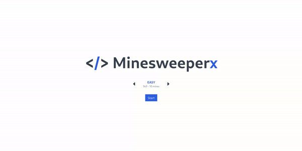

This project is my first attempt of exploring the [HTMX library](https://htmx.org/).
I decided to give it a shot implementing a Minesweeper clone and, honestly, I had a ton of fun!

## Preview



## Requirements

The preferred way to execute the project is by building an image with the 
provided _Containerfile_ using Docker or Podman. However, if you really
do not want to use containers, you will need:

- Go 1.22
- An internet connection (at this very moment third-party libraries are accessed via CDN)

## Build


### Container
To build the container, run the following commaind in the project folder:

```
# if you have docker
docker build -t minesweeperx .

# if you have podman
podman build -t minesweeperx .
```

### Locally

Clone the repository in your machine and then run the following command in the project folder:

```
go build .
```

This will create a _Minesweeperx_ executable file

## Run

### From container

```
# if you have docker
docker run --rm -p 3000:3000 localhost/minesweeperx:latest

# if you have podman
podman run --rm -p 3000:3000 localhost/minesweeperx:latest
```

### From local build 

Just run the _Minesweeperx_ executable file or, in case you didn't build it,
run the following in the project folder:

```
go run .
```


## Tech Stack

- **Go** for back-end
- **HTMX** for front-end
- **TailwindCSS** for styling
- **FontAwesome** for, well, icons
